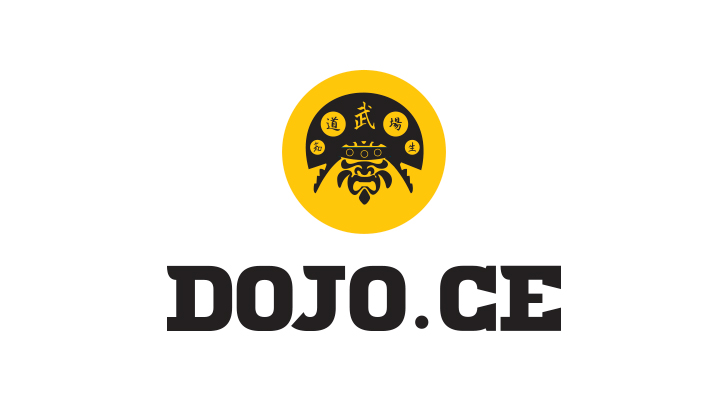

## Olá, seja bem-vindo ao DojoCE!

Hoje em dia, a toda hora é lançada uma nova linguagem, um novo framework, uma nova atualização etc. Por conta disso, dedicamos boa parte do nosso tempo desenvolvendo e esquecemos (ou simplesmente não temos tempo) de praticar nossa arma fundamental: **lógica**.

Pensando nisso, o Coding Dojo foi criado para que o programador possa aprender colocando em prática seus conhecimentos para resolver desafios de lógica propostos no dia do encontro. Vale lembrar que o Dojo vai muito além do código, nele é possível melhorar o trabalho em grupo, desenvolver a socialização de cada um, aumentar seu networking, aprender novas tecnologias e vários outros benefícios !

O DojoCE acredita poder mudar o cenário cearense de desenvolvimento através dessa iniciativa. Não deixe de participar dos nossos encontros !

## Encontros

Nossos encontros serão marcados com 1 semana de antecedência através de eventos criados no nosso [grupo](https://www.facebook.com/groups/dojo.ce/) no facebook. Os encontros serão feitos no primeiro sábado de cada mês pela manhã e terá duração de 3h (9h às 12h).

## Desafios

Nossos desafios serão **escolhidos no dia da reunião** através do [Dojo Puzzles](http://dojopuzzles.com/) ou de sugestões feitas a partir do grupo, onde nos 2 métodos serão sorteados o desafio.

## Linguagem

A linguagem utilizada no dia do Dojo será escolhida em comum acordo, porém, é necessário que tenha pelo menos 1 especialista na linguagem escolhida para aquele encontro. Utilizaremos TDD para efetuar os testes, então, é necessário que o especialista na linguagem também tenha domínio em TDD.

## Regras

1. É necessário ter uma sala com apenas 1 computador ligado.
2. Toda a codificação será feita em dupla (piloto e copiloto).
3. Todo o código produzido pela dupla deverá ser explicado para a platéia.
4. Caso alguém da platéia não esteja entendendo algo que a dupla executou, a dupla para a codificação e explica o código. A codificação só é retomada quando todos da platéia estiverem entendendo o que está sendo executado.
5. A platéia só pode ajudar a dupla quando todos os testes estiverem validados, caso contrário, poderão apenas tirar dúvidas.
6. O piloto é trocado a cada 7 minutos. Após isso, o copiloto assume o lugar do piloto e alguém da platéia assume o lugar do copiloto. O ciclo se repete até o fim do Dojo.
7. O desafio completado será inserido no [repositório do Dojo](https://github.com/dojo-ce/). Caso o desafio não seja completado, será retomado no próximo Dojo.

## Dúvidas ?

Se você ainda possui alguma dúvida sobre o funcionamento/conceito de um dojo, acesse nosso [grupo](https://www.facebook.com/groups/dojo.ce/) no facebook para esclarecer suas dúvidas e assista esses 2 vídeos:

- [Coding Dojo: Globo.com](https://www.youtube.com/watch?v=vqnwQ3oVM1M)
- [Coding Dojo: Muito além do código !](https://www.youtube.com/watch?v=RaNcCOBb3RI)
